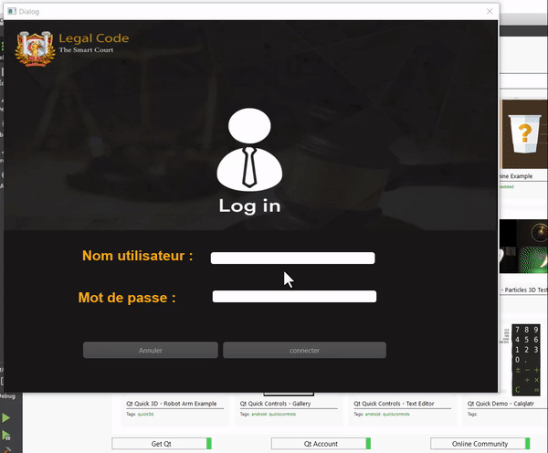

     
# Projects

<table bordercolor="#66b2b2">

<tbody>

<tr>

<td width="60%" valign="top">

### Esif

   

 

**C programming under Linux** - 2D Isometric game with its controller .

</td>

<td width="50%" valign="top">

### Smart Court

   

 

**C++ & MySQL** - Design and development of a desktop application for a smart court .

</td>
</tr>
</tbody>

</table>
<table bordercolor="#66b2b2">

<tbody>
<tr>
<td width="100%" valign="top">

</td>
</tr>

</tbody>

</table>

# Technologies

            

# Connect

    
